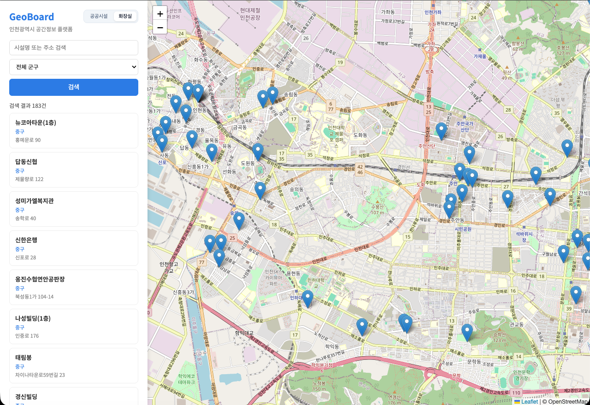

# GeoBoard
인천광역시 공공시설·화장실 위치 조회 및 차선 안내 기능을 갖춘 GIS 웹 애플리케이션

[](https://github.com/jinsh1210/GeoBoard)
[](https://www.python.org)

<br />

## Screenshots



## Features

### 공간정보 조회
- **이중 레이어 전환**: 사이드바 토글로 공공시설(24개소)과 민간개방 화장실(183개소) 즉시 전환
- **공공시설 필터**: 시설 유형(다목적실·회의실·강의실 등)과 유/무료 여부로 검색 범위 축소
- **화장실 필터**: 군구(중구·미추홀구·부평구 등 9개 구)별 필터링
- **지도 팝업**: 마커 클릭 시 시설명·운영시간·주소·전화번호 등 상세 정보 표시
- **카드 연동**: 사이드바 결과 카드 클릭 시 지도가 해당 위치로 자동 이동

### 2D / 3D 뷰
- **2D / 3D 뷰 전환**: 사이드바 토글로 Leaflet 2D 지도와 Maptiler 3D 뷰를 즉시 전환
- **3D 건물 시각화**: OSM `render_height` 속성 기반 fill-extrusion으로 건물 높이 시각화, 높이별 파란 그라데이션
- **건물 클릭 정보**: 3D 뷰에서 건물 클릭 시 높이·층수·유형·좌표를 오버레이 패널로 표시
- **3D 검색 핀**: 검색 결과를 3D 빨간 기둥으로 지도 위에 표시, 카드 클릭 시 해당 위치로 flyTo

### 차선 안내
- **경로 탐색**: Kakao Local API 자동완성으로 출발지·목적지 검색 후 OSRM 경로 탐색
- **3D 경로 오버레이**: Maptiler 3D 지도 위에 GeoJSON 경로 라인 실시간 표시
- **차량 주행 시뮬레이션**: 🚗 차량 마커가 `requestAnimationFrame` 루프로 경로를 따라 부드럽게 이동
- **카메라 추적**: 주행 방향에 맞춰 카메라가 차량을 실시간 추적 (heading 자동 회전)
- **차선 안내 HUD**: 현재 maneuver 기반 권장 차선·방향 화살표·거리 정보를 지도 위 오버레이로 표시
- **도착 감지**: 🏁 도착 마커 표시, 목적지 도달 시 HUD 자동 숨김 및 "목적지 도착" 안내

## Installation

### Requirements

- Python 3.9+

### Run locally

```sh
# 1. Clone
git clone https://github.com/jinsh1210/GeoBoard.git
cd GeoBoard

# 2. Install dependencies
pip install -r requirements.txt

# 3. Start server (Kakao API 키 필요)
cd src && KAKAO_API_KEY=<your_kakao_rest_key> python -m uvicorn main:app --host 0.0.0.0 --port 8000
```

브라우저에서 `http://localhost:8000` 접속

## Project Structure

```
GeoBoard/
├── data/
│   ├── 인천광역시_미추홀구_공공시설개방정보_20251101.csv
│   └── restrooms_geocoded.csv      # Kakao Local API로 좌표 변환 (183/183)
├── src/
│   ├── main.py                     # FastAPI 앱 — 시설/화장실 검색, Kakao 지오코딩 프록시
│   ├── db.py                       # SQLite 스키마 초기화
│   └── load_csv.py                 # CSV → SQLite 로더 (시작 시 자동 실행)
├── static/
│   ├── index.html                  # 메인 페이지
│   ├── map.js                      # Leaflet 2D + Maptiler 3D + 차선 안내 로직
│   └── style.css                   # 스타일
└── requirements.txt
```

## API Reference

| Method | Path | Parameters | Description |
|--------|------|------------|-------------|
| GET | `/api/facilities` | `keyword`, `type`, `is_paid` | 공공시설 검색 |
| GET | `/api/restrooms` | `keyword`, `gu` | 민간개방 화장실 검색 |
| GET | `/api/geocode` | `q` | Kakao 주소·키워드 지오코딩 |
| GET | `/api/suggest` | `q` | Kakao 키워드 자동완성 (최대 5건) |

## Data Sources

| 데이터 | 출처 | 건수 |
|--------|------|------|
| 인천광역시 미추홀구 공공시설개방정보 | 공공데이터포털 | 24 |
| 인천광역시 민간개방 화장실 현황 | 인천광역시 공공데이터 | 183 |

좌표 변환: [Kakao Local API](https://developers.kakao.com/docs/latest/ko/local/dev-guide) `/v2/local/search/address.json` — 183/183 (100%)

## Credits

- [FastAPI](https://fastapi.tiangolo.com) — Python REST API 프레임워크
- [Leaflet.js](https://leafletjs.com) — 인터랙티브 웹 지도 라이브러리 (2D 뷰)
- [Maptiler SDK](https://docs.maptiler.com/sdk-js/) — 3D 건물 fill-extrusion 렌더링 및 차선 안내 지도
- [OSRM](http://project-osrm.org) — 오픈소스 경로 탐색 엔진
- [OpenStreetMap](https://www.openstreetmap.org) — 오픈소스 지도 타일 및 건물 높이 데이터
- [Kakao Local API](https://developers.kakao.com) — 한국 주소 지오코딩 및 키워드 검색
- [pandas](https://pandas.pydata.org) — CSV 데이터 처리
